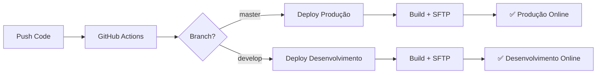
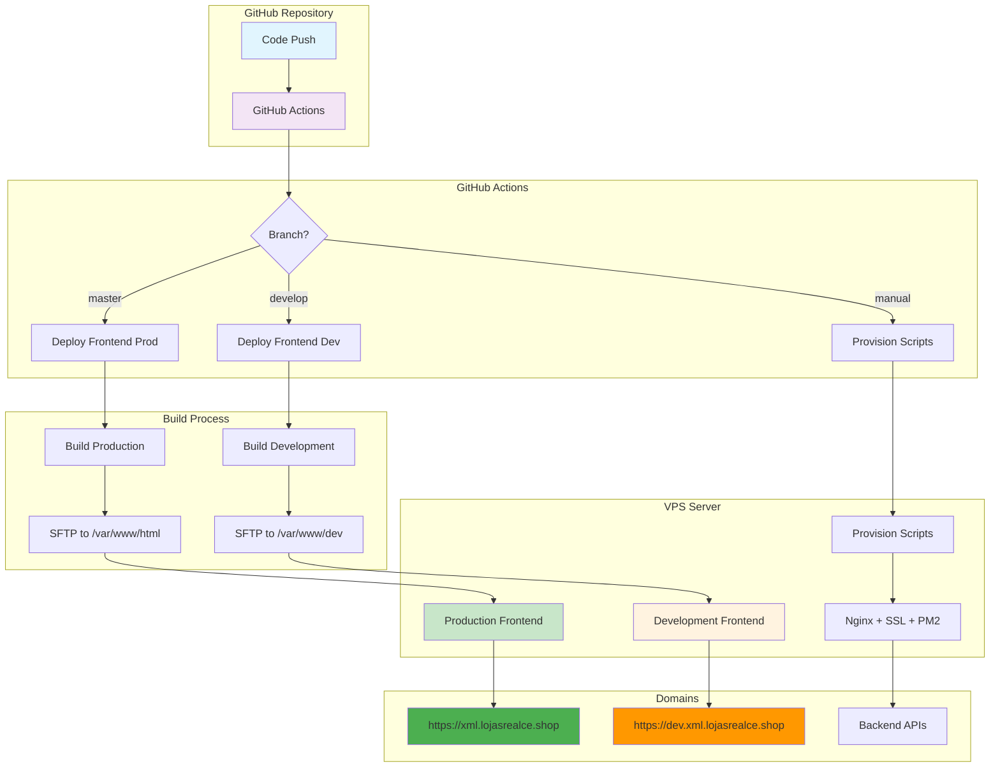
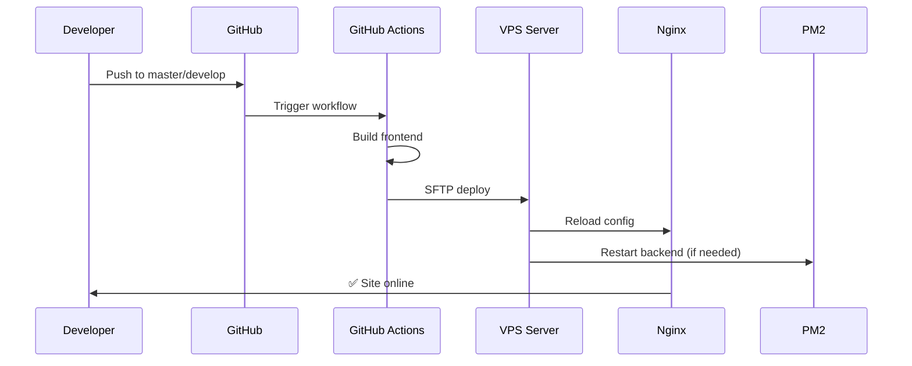

# 🚀 XML Importer - Sistema de Importação e Gestão de NFEs

[](https://github.com/pedroojr/xml-4/actions)
[](https://github.com/pedroojr/xml-4/actions)
[](https://opensource.org/licenses/MIT)

> Sistema completo para importação, processamento e gestão de Notas Fiscais Eletrônicas (NFEs) com interface web moderna e API robusta.

## 📋 **Índice**

- [🏗️ Arquitetura](#️-arquitetura)
- [🌍 Ambientes](#-ambientes)
- [🚀 Deploy e CI/CD](#-deploy-e-cicd)
- [🔧 Configuração](#-configuração)
- [📚 Documentação Técnica](#-documentação-técnica)
- [🤖 Prompt GPT para Deploy](#-prompt-gpt-para-deploy)
- [📊 Fluxo CI/CD Visual](#-fluxo-cicd-visual)
- [🛠️ Desenvolvimento Local](#️-desenvolvimento-local)
- [📞 Suporte](#-suporte)

---

## 🏗️ **Arquitetura**

### **Stack Tecnológica**
- **Frontend**: React + Vite + TypeScript
- **Backend**: Node.js + Express + SQLite
- **Deploy**: GitHub Actions + SFTP + Nginx
- **SSL**: Let's Encrypt + Certbot
- **Process Manager**: PM2
- **Servidor**: Hostinger VPS (Ubuntu)

### **Estrutura do Projeto**
```
xml-4/
├── src/                   # Frontend React
├── public/                # Assets estáticos do frontend
├── server/                # Backend Node.js
│   ├── server.js          # Servidor principal
│   └── package.json       # Dependências backend
├── .github/workflows/     # GitHub Actions
├── provision-scripts/     # Scripts de provisionamento
└── README.md              # Esta documentação
```

> **Nota:** o frontend legado antes localizado em `lixo/` foi removido. O conteúdo permanece disponível para referência histórica no commit `15da140915cf6e02979702ec2191f21e80b6b055`.

---

## 🌍 **Ambientes**

### **🏭 Produção**
- **Frontend**: https://xml.lojasrealce.shop/
- **API**: https://api.xml.lojasrealce.shop/
- **Porta Backend**: 3001
- **Diretório**: `/var/www/html`
- **Status**: ✅ **Funcionando**

### **🧪 Desenvolvimento**
- **Frontend**: https://dev.xml.lojasrealce.shop/
- **API**: https://dev-api.xml.lojasrealce.shop/
- **Porta Backend**: 3002
- **Diretório**: `/var/www/dev`
- **Status**: ✅ **Funcionando**

---

## 🚀 **Deploy e CI/CD**

### **Workflows GitHub Actions**

#### **1. Deploy Frontend (Produção)**
```yaml
Trigger: Push para master
Target: /var/www/html
URL: https://xml.lojasrealce.shop/
```

#### **2. Deploy Desenvolvimento**
```yaml
Trigger: Push para develop/dev
Target: /var/www/dev
URL: https://dev.xml.lojasrealce.shop/
```

#### **3. Provisionamento**
- **Provision API**: Configura produção
- **Provision Frontend**: Configura produção  
- **Provision Dev**: Configura desenvolvimento

### **Fluxo de Deploy Automático**


---

## 🔧 **Configuração**

### **Variáveis de Ambiente**

#### **Frontend (.env)**
```bash
# Desenvolvimento
VITE_API_URL=https://dev-api.xml.lojasrealce.shop
VITE_ENV=development

# Produção
VITE_API_URL=https://api.xml.lojasrealce.shop
VITE_ENV=production
```

#### **Backend (.env)**
```bash
# Desenvolvimento
NODE_ENV=development
PORT=3002
ALLOWED_ORIGINS=https://dev.xml.lojasrealce.shop

# Produção
NODE_ENV=production
PORT=3001
ALLOWED_ORIGINS=https://xml.lojasrealce.shop,https://www.xml.lojasrealce.shop
```

### **Configuração PM2**

#### **Produção (ecosystem.config.js)**
```javascript
module.exports = {
  apps: [{
    name: 'xml-importer-api',
    script: 'server/server.js',
    env: {
      NODE_ENV: 'production',
      PORT: 3001,
      ALLOWED_ORIGINS: 'https://xml.lojasrealce.shop,https://www.xml.lojasrealce.shop'
    }
  }]
};
```

#### **Desenvolvimento (ecosystem-dev.config.js)**
```javascript
module.exports = {
  apps: [{
    name: 'xml-importer-api-dev',
    script: 'server/server.js',
    env: {
      NODE_ENV: 'development',
      PORT: 3002,
      ALLOWED_ORIGINS: 'https://dev.xml.lojasrealce.shop'
    }
  }]
};
```

---

## 📚 **Documentação Técnica**

### **Persistência de Itens Ocultos (hiddenItems)**

#### **Contrato de API**
- **Campo**: `hiddenItems: string[]` em `NFE`
- **Semântica**: Lista de IDs estáveis (string) de itens ocultos por NF

#### **Regras do Backend**
- `PUT /api/nfes/:id` grava `hiddenItems` com `JSON.stringify`
- `GET /api/nfes/:id` retorna `hiddenItems` como array (via `JSON.parse`), fallback `[]`
- Updates parciais preservam `hiddenItems` quando não enviados no body

#### **Fluxo no Frontend**
1. **Carregar**: Obter `NFE` do servidor e ler `hiddenItems`
2. **Aplicar**: Filtrar itens cujo ID está em `hiddenItems`
3. **Render**: Exibir lista principal sem ocultos; visão "apenas ocultados" mostra os ocultos
4. **Toggle**: Ao ocultar/desocultar, calcular `nextHiddenItems` e enviar `PUT` com o array atualizado
5. **Fonte única**: Servidor (IDs estáveis string em todo pipeline)

#### **IDs Estáveis (string)**
Preferência de composição:
- EAN se existir
- senão `cod:${codigo}:${index}`
- senão `ref:${reference}:${index}`

#### **Testes**
##### **Integração**
1. `PUT` `hiddenItems` → `GET` deve bater
2. `PUT` parcial (ex.: `valorFrete`) → `GET` mantém `hiddenItems`

##### **E2E (com Playwright/Cypress)**
1. Ocultar 2 itens → reload → continuam ocultos
2. Desocultar 1 → reload → apenas ele volta; o outro segue oculto

#### **Observabilidade**
- Logs DB (DB_OPEN/NFES_COLUMNS) condicionais a `DEBUG_DB=true` (off por padrão)
- Logs essenciais de request/erro permanecem

---

## 🤖 **Prompt GPT para Deploy**

### **Prompt Completo para Gerenciamento de Deploys**

```
Você é um assistente especializado em DevOps e CI/CD para o projeto XML Importer. 

## CONTEXTO DO PROJETO
- **Repositório**: https://github.com/pedroojr/xml-4
- **Tecnologias**: React + Node.js + SQLite + GitHub Actions
- **Servidor**: Hostinger VPS (82.29.58.242)
- **Domínios**: xml.lojasrealce.shop (prod) + dev.xml.lojasrealce.shop (dev)

## AMBIENTES CONFIGURADOS
1. **Produção**: 
   - Frontend: https://xml.lojasrealce.shop/
   - API: https://api.xml.lojasrealce.shop/ (porta 3001)
   - Diretório: /var/www/html

2. **Desenvolvimento**:
   - Frontend: https://dev.xml.lojasrealce.shop/
   - API: https://dev-api.xml.lojasrealce.shop/ (porta 3002)
   - Diretório: /var/www/dev

## WORKFLOWS DISPONÍVEIS
- **Deploy Frontend**: Trigger automático em push para master
- **Deploy Dev**: Trigger automático em push para develop/dev
- **Provision API**: Configuração manual via script
- **Provision Frontend**: Configuração manual via script
- **Provision Dev**: Configuração manual via script

## INSTRUÇÕES ESPECÍFICAS
1. **Para deploy automático**: Push para branch master (produção) ou develop (desenvolvimento)
2. **Para deploy manual**: Use GitHub Actions → "Run workflow"
3. **Para provisionamento**: Execute scripts no servidor via SSH
4. **Para troubleshooting**: Verifique logs do PM2 e Nginx

## COMANDOS ÚTEIS NO SERVIDOR
```bash
# Status dos serviços
pm2 status
pm2 logs xml-importer-api
pm2 logs xml-importer-api-dev

# Verificar Nginx
nginx -t
systemctl status nginx

# Logs do sistema
journalctl -u nginx -f
tail -f /var/log/nginx/error.log
```

## RESPONDA SEMPRE COM
1. **Análise do problema** (se houver)
2. **Passos específicos** para resolver
3. **Comandos exatos** para executar
4. **Verificação** de que funcionou
5. **Próximos passos** recomendados

## EXEMPLO DE RESPOSTA
"Identifiquei o problema: [descrição]. Para resolver:

1. Execute: [comando específico]
2. Verifique: [como verificar]
3. Confirme: [o que deve aparecer]

Após resolver, teste: [como testar]"
```

---

## 📊 **Fluxo CI/CD Visual**

### **Diagrama de Arquitetura Completa**



### **Fluxo de Deploy Detalhado**



---

## 🛠️ **Desenvolvimento Local**

### **Setup Inicial**
```bash
# Clone o repositório
git clone https://github.com/pedroojr/xml-4.git
cd xml-4

# Instalar dependências frontend (raiz do projeto)
npm install

# Instalar dependências backend
cd server
npm install
```

### **Comandos de Desenvolvimento**
```bash
# Frontend (na raiz do projeto)
npm run dev          # Servidor de desenvolvimento
npm run build        # Build de produção

# Backend (desde server/)
npm start            # Iniciar servidor
npm run dev          # Modo desenvolvimento
```

### **Estrutura de Branches**
```bash
master    # Produção (deploy automático)
develop   # Desenvolvimento (deploy automático)
feature/* # Novas funcionalidades
hotfix/*  # Correções urgentes
```

---

## 📞 **Suporte**

### **Troubleshooting Comum**

#### **1. Deploy não funcionou**
```bash
# Verificar GitHub Actions
# Verificar logs do servidor
ssh root@82.29.58.242 "pm2 status"
ssh root@82.29.58.242 "nginx -t"
```

#### **2. SSL não funciona**
```bash
# Verificar certificados
ssh root@82.29.58.242 "certbot certificates"
# Renovar se necessário
ssh root@82.29.58.242 "certbot renew"
```

#### **3. Backend não responde**
```bash
# Verificar PM2
ssh root@82.29.58.242 "pm2 status"
ssh root@82.29.58.242 "pm2 logs xml-importer-api"
```

### **Contatos e Recursos**
- **Repositório**: https://github.com/pedroojr/xml-4
- **Issues**: https://github.com/pedroojr/xml-4/issues
- **Actions**: https://github.com/pedroojr/xml-4/actions
- **Servidor**: root@82.29.58.242

### **Logs e Monitoramento**
- **GitHub Actions**: Logs detalhados de cada workflow
- **PM2**: Monitoramento de processos Node.js
- **Nginx**: Logs de acesso e erro
- **Sistema**: journalctl para serviços

---

## 📄 **Licença**

Este projeto está licenciado sob a Licença MIT - veja o arquivo [LICENSE](LICENSE) para detalhes.

---

## 🎯 **Status do Projeto**

- **✅ Produção**: Funcionando perfeitamente
- **✅ Desenvolvimento**: Configurado e funcionando
- **✅ CI/CD**: Automatizado via GitHub Actions
- **✅ SSL**: Certificados válidos para todos os domínios
- **✅ Monitoramento**: PM2 + Nginx + Logs estruturados

**🚀 Projeto 100% funcional e pronto para produção!**


